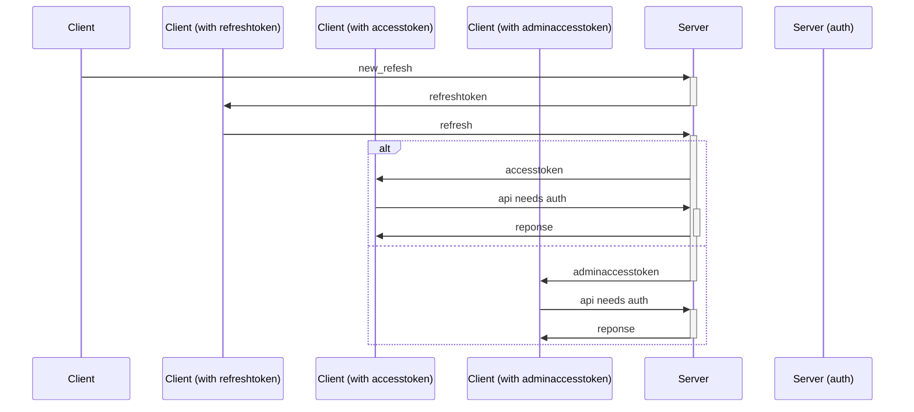
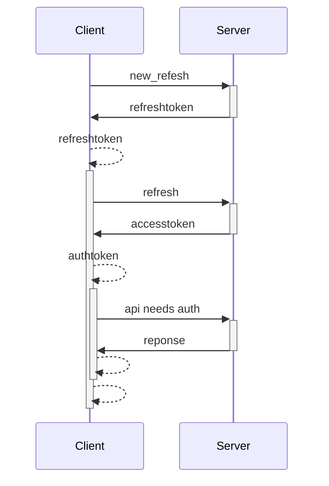
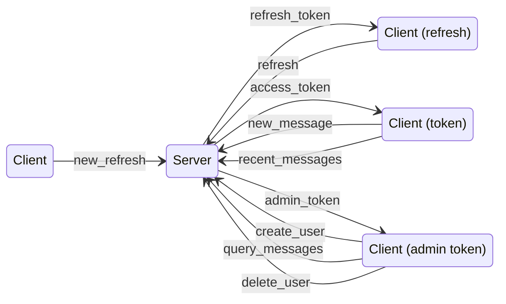

```mermaid
sequenceDiagram
    participant C as Client
    participant C1 as Client (with refreshtoken)
    participant C2 as Client (with accesstoken)
    participant C3 as Client (with adminaccesstoken)
    participant S as Server
    participant S1 as Server (auth)
    C->>+S: new_refesh
    S->>-C1: refreshtoken
    C1->>+S: refresh  
    alt
    S->>C2: accesstoken
    C2->>+S: api needs auth
    S->>-C2: reponse
    else
    S->>-C3: adminaccesstoken
    C3->>+S: api needs auth
    S->>-C3: reponse
    end
```

```mermaid
sequenceDiagram
    participant C as Client
    participant S as Server
    C->>+S: new_refesh
    S->>-C: refreshtoken
    C-->>+C : refreshtoken
    C->>+S: refresh
    S->>-C: accesstoken
    C-->>+C : authtoken
    C->>+S: api needs auth
    S->>-C: reponse
    C-->>-C: 
    C-->>-C: 
```

```mermaid
stateDiagram-v2
    direction LR 
    C : Client
    C1 : Client (refresh)
    C2 : Client (token)
    C3 : Client (admin token)
    S : Server
    C --> S : new_refresh
    S --> C1: refresh_token
    C1 --> S : refresh
    S --> C2 : access_token
    S --> C3 : admin_token

    C2 --> S : new_message
    C2 --> S : recent_messages

    C3 --> S : create_user
    C3 --> S : query_messages
    C3 --> S : delete_user
```
